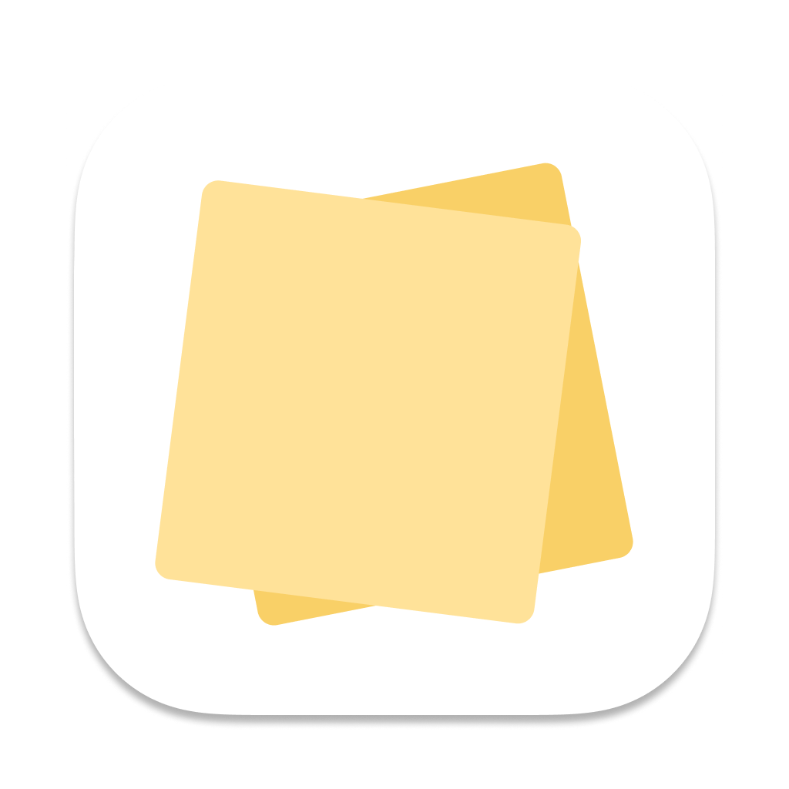

# 📝 Python Sticky Notes
by: Alexandre Aragão




A simple, cross-platform Sticky Notes app built with Python and QtPy5. Easily create, edit, and manage your notes with a clean and intuitive interface.


## 📌 Index
- [📦 Installation](#-installation)
- [🛠️ Building from Source](#-building-from-source)
- [🏗️ Packaging the App](#-packaging-the-app)
- [🔧 Configuration](#-configuration)
- [📜 License](#-license)
- [💡 Contributing](#-contributing)
- [🌟 Acknowledgments](#-acknowledgments)

## 📦 Installation

> Currently this project don't provide an automatic way to install the app. Thats being worked on!

### macOS (App Bundle)
1. See the [Packaging](#️-packaging-the-app) tutorial to generate the `.app` file.
2. Move it to the Applications folder.

## 🛠️ Building from Source

### Prerequisites
- Python 3.8+
- pip
- Qt for Python (PyQt / PySide)

### Steps
1. Clone the repository:
   ```sh
   git clone https://github.com/yourusername/python-sticky-notes.git
   cd python-sticky-notes
   ```
2. Create and activate a virtual environment:
   ```sh
   python -m venv venv
   source venv/bin/activate  # macOS/Linux
   venv\Scripts\activate     # Windows
   ```
3. Install dependencies:
   ```sh
   make install
   ```
4. Run the app:
   ```sh
   make run
   ```
5. Have fun!

## 🏗️ Packaging the App

### macOS
```sh
make macos-build
```
More information on [MacOS Packaging](docs/macos_packaging.md)

## 📜 License
This project is licensed under the MIT License - see the [LICENSE](LICENSE) file for details.

## 💡 Contributing
Pull requests are welcome! For major changes, please open an issue first to discuss what you’d like to change.

## 🌟 Acknowledgments
- Built with Python and PyQt5
